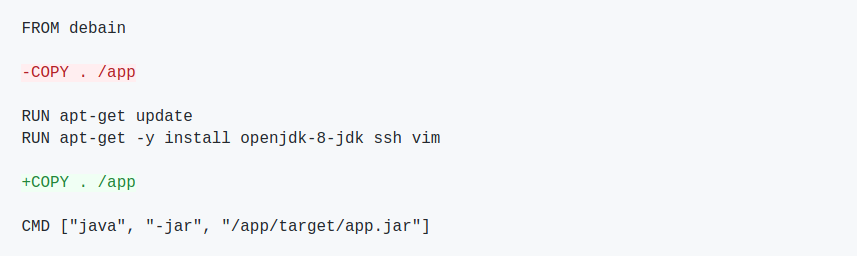
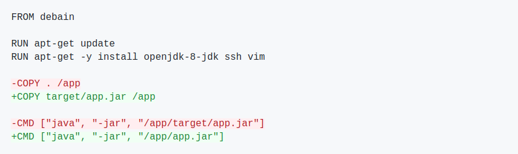
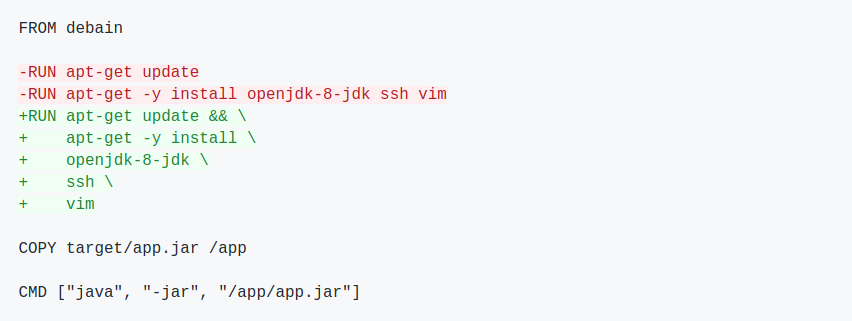
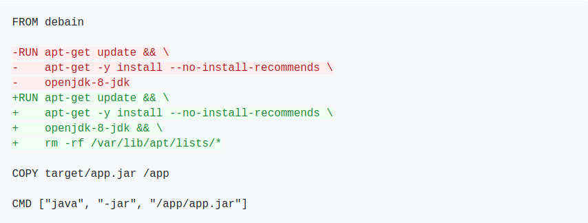
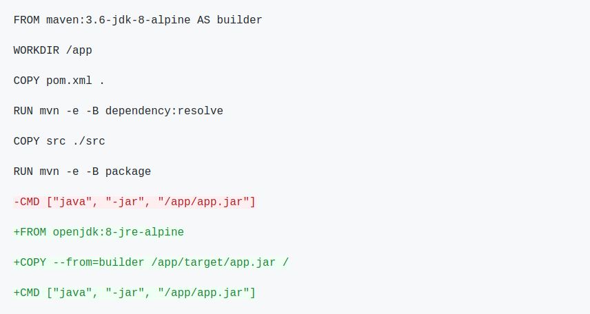

# Docker

## Docker/Containerisierung vs. Virtualisierung

* Virtuelle Maschinen (VM):
  * Isolation von Hardware
  * Jede VM hat ihren eigenen Kernel
  * Großer Overhead (OS, Treiber, ...)
* Containerisierung:
  * Isolation von Software
  * Mehrere Container teilen sich den Kernel und andere Ressourcen des Host-Systems
  * Leichtgewichtiger als VMs


## Übersicht Docker

* Docker ist Freie Software ([https://github.com/docker](https://github.com/docker))
* Geschrieben in Go
* Isolierung von Software durch Containervirtualisierung
* Einfache und schnelle Bereitstellung von Anwendungen unabhängig vom Host-System
* Unterstützt Modularität (Microservices)
* Versionskontrolle/Rollbacks

## Zentrale Docker Begriffe

* **Dockerfile**
  * Textdatei mit Schritt-für-Schritt "Bauanleitung" für Docker-Images
* **Image**
  * Endprodukt des Bauens eines Dockerfiles, "Speicherabbild"
* **Container**
  * Konkret (laufende) Instanz eines Images
* **Registry**
  * Privates oder öffentliches Repository für Images, etwa https://hub.docker.com/

## Zentrale Docker Befehle

Häufige Docker Befehle für die Kommandozeile:

* **`docker help`**
  * docker help [command], z.B. `docker help build`
* **`docker build`**
  * zur Erzeugung eines Images aus einem Dockerfile
* **`docker run`**
  * zum Starten eines Containers auf Basis eines Images
* **`docker log`**
  * zum Einsehen der Logs eines laufenden Containers
* **`docker stop`**
  * zum Stoppen eines laufenden Containers
* **`docker ps`**
  * listet alle aktuell laufenden Container
* **`docker exec`**
  * ermöglicht die Ausführung von Befehlen in einem Container
* **`docker images`**
  * listet alle lokalen Images
* **`docker pull`**
  * lädt ein Image aus einer Registry
* **`docker push`**
  * lädt ein lokales Image in eine Registry

## Architektur Docker Engine


## Aufgaben:

* Öffnen Sie ein Terminalfenster und führen Sie folgenden Befehl aus:
```
docker run hello-world
```
* Versuchen Sie die einzelnen Schritte der Ausgabe dieses Befehls zu erläutern.

## Dockerfile

Das Dockerfile beschreibt durch die Auflistung von Befehlen der Form
[BEFEHL] [parameter] den Aufbau des Images, das aus ihm
erzeugt wird.

Die wichtigsten Befehle in Dockerfiles:

* **`FROM`**
  * der erste Befehl und bestimmt das "Vater"-Image, das als Startpunkt dient
  * Beispiel: `FROM ubuntu:18.04`
* **`RUN`**
  * führt den übergebenen Parameter als
  * es können nur Befehle ausgeführt werden, die im Image möglich sind und somit vom
    Vater-Image abhängen
  * Beispiel: `RUN sudo apt-get install -y apache2`
* **`COPY (bzw. ADD)`**
  * kopiert lokale Dateien vom Host-System in das Image
  * Beispiel: `COPY local_image.jpg /opt/image.jpg`
* **`WORKDIR`**
  * wechselt im Image in das übergebene Verzeichnis
  * Beispiel: `WORKDIR /opt`
* **`CMD (bzw. ENTRYPOINT )`**
  * definiert den Standardbefehl, der später vom Container ausgeführt wird. Diesen
    Befehl kann es nur einmal pro Dockerfile geben (oder der letzte "gewinnt").
  * Beispiel: `CMD echo "Hello world"` oder `CMD myScript.sh`
* **`EXPOSE`**
  * dient der Dokumentation des Prozessports
  * Beispiel: `EXPOSE 8080`

Hinweis: RUN, COPY und ADD erzeugen immer einen neuen, eindeutigen "Layer". Das resultierende
Image ist letzlich die (geordnete) Sammlung von zahlreichen Layern.

## Beispiel

###  Dockerfile

```
FROM busybox:1.35.0

RUN echo "Hello World" > /fossgis.txt

RUN cat /fossgis.txt

CMD ["cat", "/fossgis.txt"]
```

### Image bauen

```
docker build -t fossgis:1.0.0 .
```

### Image starten

```
docker run --name fossgis-test fossgis:1.0.0
```

## Aufgaben:

* Fügen Sie die obigen Inhalte der Beispiel-Dockerfile in eine neue Datei
  namens `Dockerfile` in einem beliebigen Verzeichnis ein, bauen Sie das Image und
  starten den Container.
* Welche Ausgabe erhalten Sie jeweils?

## Best practices

* Reihenfolge der Befehle beachten, sie wirkt sich auf das Caching der Layer aus:



<!-- ```diff
FROM debain

-COPY . /app

RUN apt-get update
RUN apt-get -y install openjdk-8-jdk ssh vim

+COPY . /app

CMD ["java", "-jar", "/app/target/app.jar"]
``` -->

* Quellen möglichst explizit kopieren:



<!-- ```diff
FROM debain

RUN apt-get update
RUN apt-get -y install openjdk-8-jdk ssh vim

-COPY . /app
+COPY target/app.jar /app

-CMD ["java", "-jar", "/app/target/app.jar"]
+CMD ["java", "-jar", "/app/app.jar"]
``` -->

* `RUN` Befehle nach Möglichkeit bündeln:



<!-- ```diff
FROM debain

-RUN apt-get update
-RUN apt-get -y install openjdk-8-jdk ssh vim
+RUN apt-get update && \
+    apt-get -y install \
+    openjdk-8-jdk \
+    ssh \
+    vim

COPY target/app.jar /app

CMD ["java", "-jar", "/app/app.jar"]
``` -->

* Keine unnötigen Abhängigkeiten installieren:


<!-- ```diff
FROM debain

-RUN apt-get update && \
-    apt-get -y install \
-    openjdk-8-jdk \
-    ssh \
-    vim
+RUN apt-get update && \
+    apt-get -y install --no-install-recommends \
+    openjdk-8-jdk

COPY target/app.jar /app

CMD ["java", "-jar", "/app/app.jar"]
``` -->

* Paketmanager-Cache löschen:



<!-- ```diff
FROM debain

-RUN apt-get update && \
-    apt-get -y install --no-install-recommends \
-    openjdk-8-jdk
+RUN apt-get update && \
+    apt-get -y install --no-install-recommends \
+    openjdk-8-jdk && \
+    rm -rf /var/lib/apt/lists/*

COPY target/app.jar /app

CMD ["java", "-jar", "/app/app.jar"]
``` -->

* Nach Möglichkeit offizielle Images benutzen:


<!-- ```diff
-FROM debain

-RUN apt-get update && \
-    apt-get -y install --no-install-recommends \
-    openjdk-8-jdk && \
-    rm -rf /var/lib/apt/lists/*

+FROM openjdk

COPY target/app.jar /app

CMD ["java", "-jar", "/app/app.jar"]
``` -->

* Möglichst spezifische Tags nutzen:


<!-- ```diff
-FROM openjdk
+FROM openjdk:8

COPY target/app.jar /app

CMD ["java", "-jar", "/app/app.jar"]
``` -->

* Möglichst kleine Basisimages nutzen, die kompatibel sind:

```
REPOSITORY   TAG            SIZE
openjdk      8              624MB
openjdk      8-jre          443MB
openjdk      8-jre-slim     443MB
openjdk      8-jre-alpine   443MB
```

* Multi-Stage Builds verwenden:



<!-- ```diff
FROM maven:3.6-jdk-8-alpine AS builder

WORKDIR /app

COPY pom.xml .

RUN mvn -e -B dependency:resolve

COPY src ./src

RUN mvn -e -B package

-CMD ["java", "-jar", "/app/app.jar"]

+FROM openjdk:8-jre-alpine

+COPY --from=builder /app/target/app.jar /

+CMD ["java", "-jar", "/app/app.jar"]
``` -->

(https://www.docker.com/blog/intro-guide-to-dockerfile-best-practices/)
