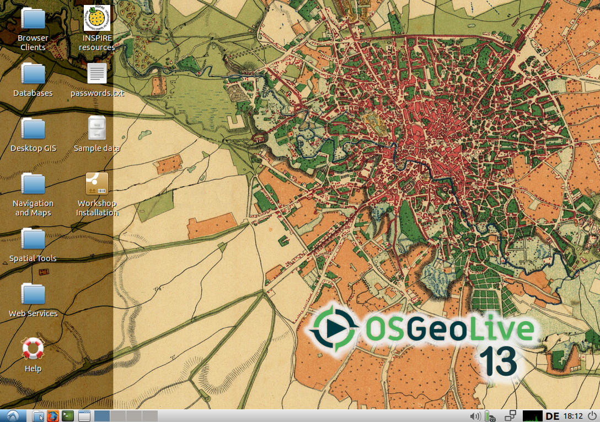

# Vorarbeiten und generelle Informationen

Bevor wir mit dem Workshop starten können, führen Sie bitte die folgenden Schritte
aus:

* Rechner mit OSGeoLive-Medium hochfahren
* Sprache auswählen (Deutsch für korrekte Tastaturbelegung)
* *Lubuntu ohne Installation ausprobieren* auswählen
* Benutzer: user; Passwort: user (wird vermutlich nicht benötigt)



## Installation docker/docker-compose

Bitte überprüfen Sie, ob `docker` und `docker-compose` korrekt installiert sind,
indem Sie das Terminal öffnen und die Eingabe von

```
docker
```

die folgende Ausgabe (Auszug) erzeugt:

```
Usage:	docker [OPTIONS] COMMAND

A self-sufficient runtime for containers

(…)
```

Prüfen Sie ebenfalls, ob die Eingabe von `docker-compose` die folgende Ausgabe
(Auszug) erzeugt:

```
Define and run multi-container applications with Docker.

(…)
```

Schlägt einer der obigen Befehle fehl, führen Sie bitte die folgenden Befehle (als `root`) aus:

```
apt update
apt install docker.io docker-compose
usermod -aG docker $USER
newgrp docker
```

Im [folgenden Abschnitt](../basics/README.md) werden wir mit Docker-Basiswissen fortfahren.
