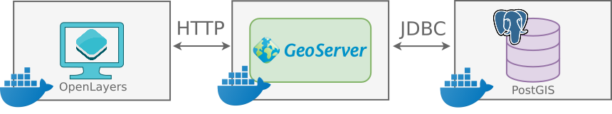
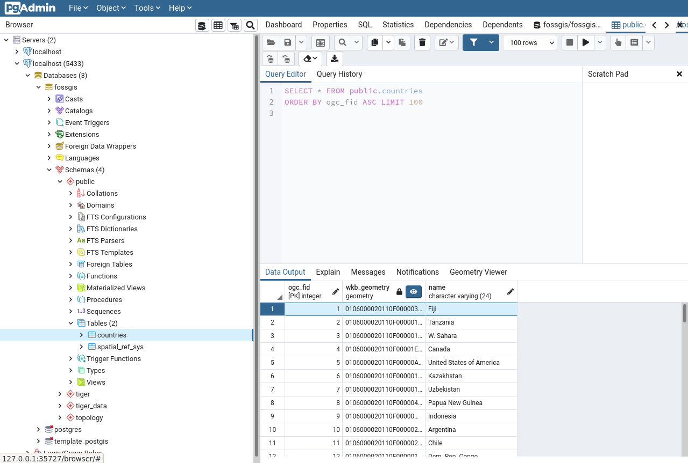
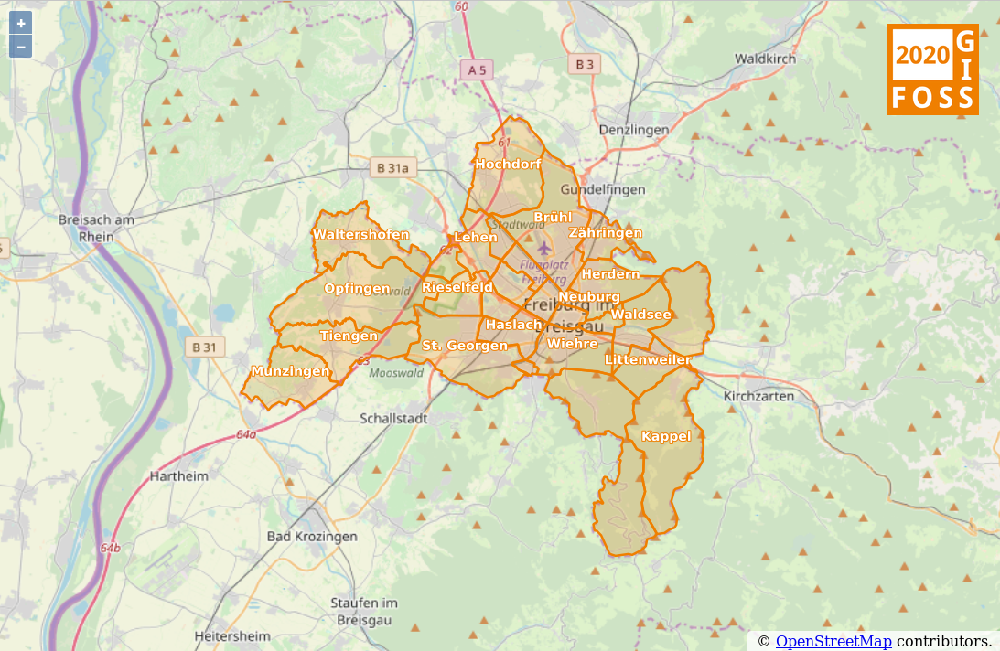

# Beispiel-GDI

In diesem Kapitel werden wir eine exemplarische GDI bestehend aus den
folgenden Komponenten aufbauen:
  * PostGIS Datenbank zur Persistierung der Geodaten.
  * GeoServer zur Veröffentlichung der Geodaten über OGC-Dienste.
  * OpenLayers Applikation zur Anzeige der Geodaten über den Browser.

## Zielarchitektur der GDI

## Aufgaben

### PostGIS-Service

* Legen Sie eine neue Datei namens `docker-compose.yml` in einem beliebigen Verzeichnis an.
* Fügen Sie dieser Datei einen neuen Service `fossgis-postgis` basierend auf dem `postgis/postgis` [Image](https://hub.docker.com/r/postgis/postgis/) in Version `15-3.3-alpine` hinzu.
  * Achten Sie beim Anlegen des Services auf das korrekte Weiterleiten des internen Ports (5432) auf den Host (5433) und legen Sie einen User mit den Zugangsdaten `fossgis:fossgis` an.
  * Mounten Sie das Datenverzeichnis der Datenbank (`/var/lib/postgresql/data`) auf das Hostsystem.
  * Setzen Sie die folgenden Umgebungsvariablen:
    * `POSTGRES_USER`: `fossgis`
    * `POSTGRES_PASSWORD`: `fossgis`
* Starten Sie den Service (über `docker compose up`).
* Importieren Sie die weltweiten Landesgrenzen (siehe `countries.sql` aus [Materialien](../../{{ book.workshopMaterialsName }})) in die Datenbank.
  * Hierzu können Sie z.B. `pgAdmin` verwenden (Datenbank `fossgis`).
  * Alternativ kann der folgende Terminal-Befehl verwendet werden: `psql -U fossgis -h localhost -p 5433 -d fossgis -f countries.sql`

### GeoServer-Service

* Erweitern Sie die `docker-compose.yml` durch den Service `fossgis-geoserver` und nutzen Sie dabei das `terrestris/geoserver:2.22.2` [Image](https://hub.docker.com/r/terrestris/geoserver).
  * Achten Sie auch hier auf das korrekte Mappen des internen Ports (8080) auf den Host (8080).
  * Mounten Sie das Datenverzeichnis des GeoServers (`/opt/geoserver_data`) auf das Hostsystem.
  * Bestimmen Sie zusätzlich die Startreihenfolge der Services mittels `depends_on`:
    1. `fossgis-postgis`
    2. `fossgis-geoserver`
* Stoppen Sie, falls noch nicht geschehen den bisherigen Service und starten Sie das compose Netzwerk neu.
* Öffnen Sie den GeoServer über die Adresse [http://localhost:8080/geoserver](http://localhost:8080/geoserver) im Browser. Nutzen Sie als Anmeldedaten `admin:geoserver`.
* Legen Sie einen neuen Arbeitsbereich `FOSSGIS` an.
* Legen Sie einen neuen Datenspeicher `POSTGIS` an und nutzen Sie dabei die folgenden Verbindungsparameter:
  * Host: `fossgis-postgis`
  * Port: `5432`
  * Database: `fossgis`
  * Schema: `public`
  * User: `fossgis`
  * Password: `fossgis`
* Legen Sie anschließend einen neuen Layer `COUNTRIES` auf Basis des Datenspeichers `POSTGIS` und der Tabelle `countries` an.
* Optional: Nutzen Sie den Stil `countries.sld` der [Materialien](../../{{ book.workshopMaterialsName }}) und weisen Sie diesen dem Layer zu.

### nginx-Service (OpenLayers Anwendung)

* Erstellen Sie auf Ebene der `docker-compose.yml` ein neues Verzeichnis `fossgis-nginx` und dort eine neue Datei `Dockerfile`.
* Legen Sie das `client`-Verzeichnis sowie die `default.conf` der [Materialien](../../{{ book.workshopMaterialsName }}) neben der `Dockerfile` ab.
* Öffnen Sie die `Dockerfile` und:
  * Wählen Sie als Basisimage die aktuelle Version des offiziellen nginx [Images](https://hub.docker.com/_/nginx) aus.
  * Kopieren Sie die Konfigurationsdatei `default.conf` in das Image und wählen Sie als Zielpfad `/etc/nginx/conf.d/default.conf`.
  * Kopieren Sie den Inhalt des entpackten Client-Archivs `client` in das Image und wählen Sie als Zielpfad `/etc/nginx/html`.
  * Geben Sie den Port (80) des nginx-Prozesses in der `Dockerfile` an.
* Fügen Sie der `docker-compose.yml` einen neuen Service `fossgis-nginx` hinzu.
  * Veröffentlichen Sie den Service-Port 80 auf dem Host-Port 8000 und wählen Sie als Build-Context die zuvor erstellte `Dockerfile`.
  * Achten Sie bei der Startreihenfolge darauf, dass der `nginx` Service zuletzt gestartet wird.
* Starten Sie anschließend alle Services neu und öffnen Sie [http://localhost:8000](http://localhost:8000) im Browser.

#### Startansicht des Kartenclients

