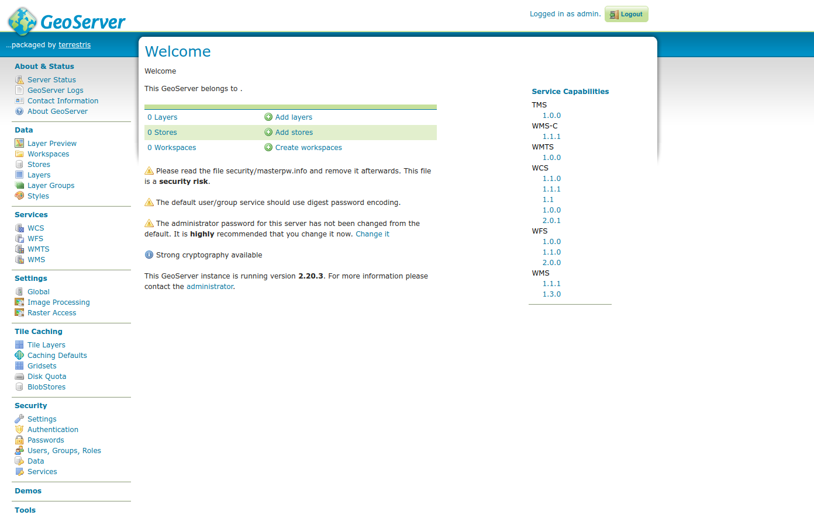

# Einrichten des GeoServer-Services

Nachdem wir die PostGIS-Datenbank erfolgreich eingerichtet haben, erweitern wir unsere **docker-compose.yml** nun um den **GeoServer**, um Geodaten als OGC-Dienste bereitzustellen.

## GeoServer-Service hinzufügen

Erweitern Sie die bestehende **`docker-compose.yml`** um einen weiteren Service.

* Name: `fossgis-geoserver`
* Image: [`docker.osgeo.org/geoserver:2.26.2`](https://github.com/geoserver/docker)

Folgende Punkte sollten berücksichtigt werden:

* Port-Mapping: Der interne (HTTP-) **Port 8080** auf sollte auf den **Host-Port 8080** weitergeleitet werden.
* Datenverzeichnis **mounten**:
   - Host: Eigener Pfad für persistente Speicherung, z.B. `./geoserver_data`
   - Container: `/opt/geoserver_data`
* **Startreihenfolge** festlegen:
   - `depends_on`: `fossgis-postgis`

✏️ **Hinweis:** Die `depends_on`-Option stellt sicher, dass der GeoServer erst gestartet wird, wenn die PostGIS-Datenbank bereit ist.


## GeoServer starten

Falls nötig, beenden Sie den laufenden Docker-Compose-Dienst:

```bash
docker compose down
```

Starten Sie das Compose-Netzwerk neu:

```bash
docker compose up
```


## Zugriff auf GeoServer

Nach dem erfolgreichen Start können Sie den **GeoServer** im Browser unter folgender Adresse aufrufen:

🔗 [http://localhost:8080/geoserver](http://localhost:8080/geoserver)

📌 **Login-Daten:**
- Benutzer: `admin`
- Passwort: `geoserver`




##  Arbeitsbereich anlegen

1. Melden Sie sich im GeoServer an.
2. Navigieren Sie zu **Arbeitsbereiche** (bzw. **Workspaces**).
3. Erstellen Sie einen neuen Arbeitsbereich mit dem Namen `FOSSGIS`.

## PostGIS-Datenquelle einbinden
1. Navigieren Sie zu **Datenspeichern** (bzw. **Stores**) und erstellen Sie einen neuen Datenspeicher **`POSTGIS`**.
2. Verwenden Sie folgende Verbindungsparameter:

| **Parameter**  | **Wert** |
|---------------|---------|
| **Host**      | `fossgis-postgis` |
| **Port**      | `5432` |
| **Database**  | `fossgis` |
| **Schema**    | `public` |
| **User**      | `fossgis` |
| **Password**  | `fossgis` |


## Neuen Layer hinzufügen

1️. Neuen Layer `COUNTRIES` anlegen
   - Quelle: Datenspeicher `POSTGIS`
   - Tabelle: `countries`

2️. Optional: Stil für den Layer festlegen
   - Verwenden Sie den Stil **`countries.sld`** aus der `materials.zip`.


## 🎯 Geschafft!

Ihr **GeoServer ist nun eingerichtet** und veröffentlicht Geodaten als Web Map Services (WMS). 🎉
Im nächsten Schritt werden wir **OpenLayers über nginx** einbinden.

➡️ Weiter zu [OpenLayers über nginx](../nginx/README.md) 🚀

